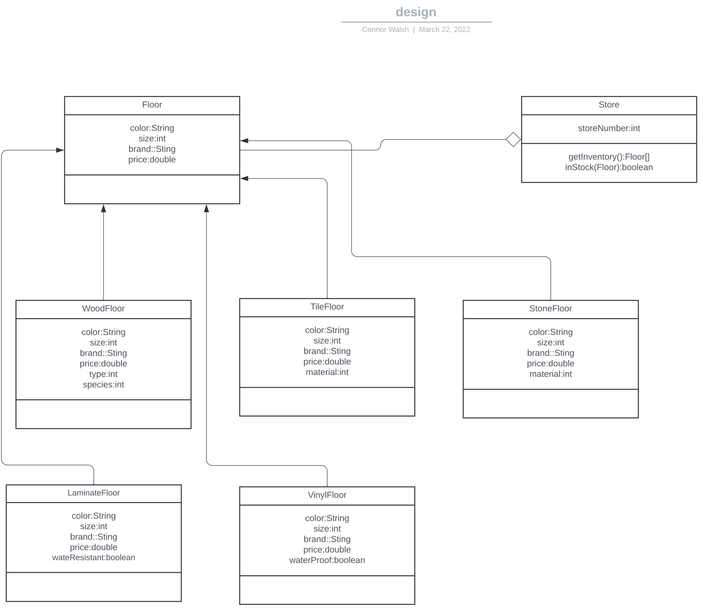
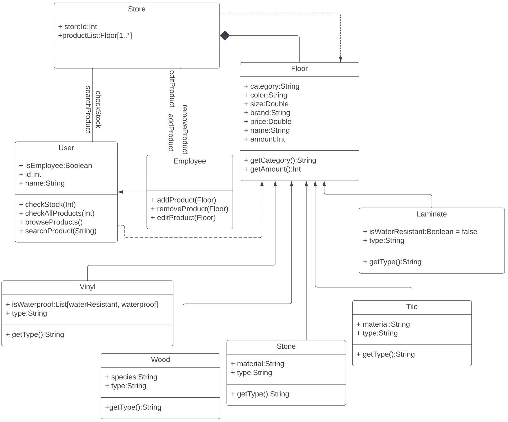
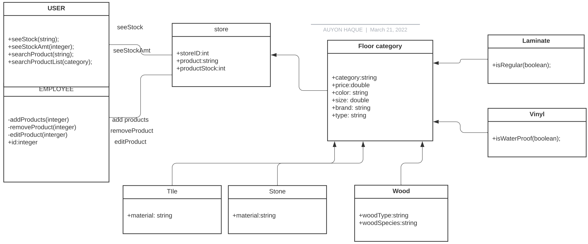
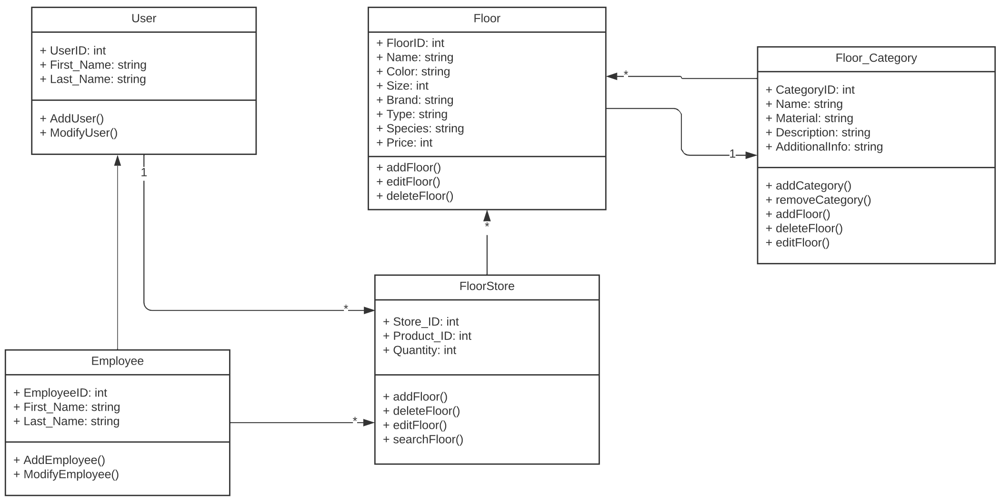
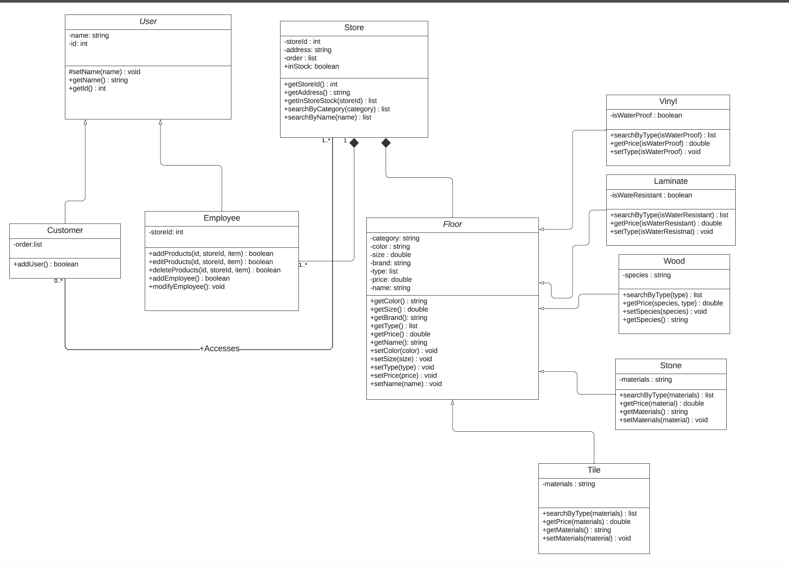

# Design Discussions

## Individual designs
### Design 1 (Connor)

#### Pros

* Made sure that floor class is inherited by the other sub classes.

* Made use of booleans for cases that applied (i.e. vinyl).

#### Cons

* Used an aggregation relationship, composition should have been used.

### Design 2 (Zheng)

#### Pros
* Made sure that Floor class is inherited by sub classes along with Employee being inherited from User.

* Showed the multiplicity of relations clearly in the UML design.

* Made all user classes and attributes private for improved integrity and security.

#### Cons

* Included price attribute in Floor class and login attribute in User/Employee these were not required.

### Design 3 (Chewantha)

#### Pros
* Made use of booleans in proper locations (i.e. user and employee).

#### Cons

* Made all attributes public, where they needed to be private to ensure their integrity.

### Design 4 (Auyon)

#### Pros
* Made sure Employee has id attribute, this helps differentiate them from normal users.

* Made proper use of booleans in the Laminate and Vinyl sub-classes.

#### Cons

* Made floor category inherit from store. Instead there should have been a composition relation from floor category to store.
* Did not properly make attributes private.

### Design 5 (Dimitry)

#### Pros

* Included inheritance of Employee from User.
* Added methods to add and remove floors in floor category class.

#### Cons
* Did not label arrows.
* Placed all categories into floor instead of breaking down each category into subclasses.

## Team Design

* We decided to use Zheng's floor class and subclasses as a starting point since they they were most organized and efficient.

* We decided to remove the login method from employee class as we thought this was unnecessary.

* We decided to create an instock() method for the store class. This will allow us to check whether an individual product is in stock. We decided to borrow this from Connor's UML design class store.

* We decided to add the methods addEmployee and modifyEmployee from Dimitry's design into the Employee class of the final.

* Moved searchByCategory and searchByName from Floor class into Store class

* We all had the common feature of inheritance from Floor classes to our sub classes of floors

* Three of our UML designs had inherited Employee class from User class so we decided to implement that feature into the main design.

## Summary

#### Lessons Learned
* We realized we needed to implement multiple floor classes that are inherited from a parent class to make the design more smooth and efficient.

* We realized we needed to use composition instead of aggregation between Employee, Floor, and Store since we cant have a store that doesn't have any floors or employees.

* We used a mix of private and public attributes in our individual designs, we needed to have all attributes set to private so no one can modify without using the proper accessor methods.

* We learned that by analyzing our teammates' UML designs we could take the best of each design in order to create the most efficient system design.
