# Design Document

**Author**: Chewantha Jayasundera

## 1 Design Considerations

### 1.1 Assumptions

- All users of the system are either employees or customers, meaning they must log in to use the app.
- The system will run on android only.
- The system will utilize a database to store all of its data.
- The user has hardware and software that is capable of running the app.
- The user's device is touchscreen capable.
- The user has a reliable internet connection whilst using the app.
- An employee works at a single store at a time.

### 1.2 Constraints

- The employee can only modify products in one store.
- The user can only interact with the stock of one store at a time.
- A customer can only browse products they cannot purchase anything.
- An employee must allow some time for any modifications that are made to be updated in the database and displayed to other users

### 1.3 System Environment

- Android mobile system, minimum of 5.0.
- The system will utilize Parse framework to create the back-end of the app.
- The front-end will be built using standard android libraries.

## 2 Architectural Design

### 2.1 Component Diagram

The store would interact with the database to display product information and to modify product information. In addition the store would interact with users, who would be the ones that initiate the above actions.

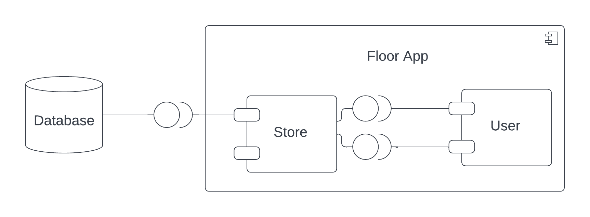

### 2.2 Deployment Diagram

The system would be deployed in two parts, the app would be deployed to android devices and the server would be deplayed to the Parse framework. There would be API calls from the device to the database and function callbacks from the database to the device. This deployment has two constraints: the device has a stable internet acccess and the server is up and running.

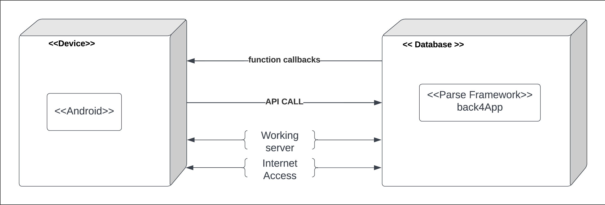

## 3 Low-Level Design

### 3.1 Class Diagram

### 3.2 Other Diagrams

This is a sequence diagram describing how an employee user would browse for a product and delete it.
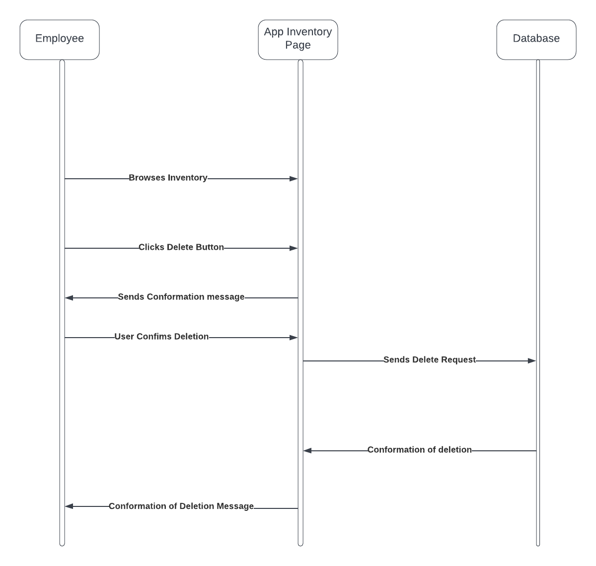

This is a sequence diagram describing how an employee user would search for a product and delete it.
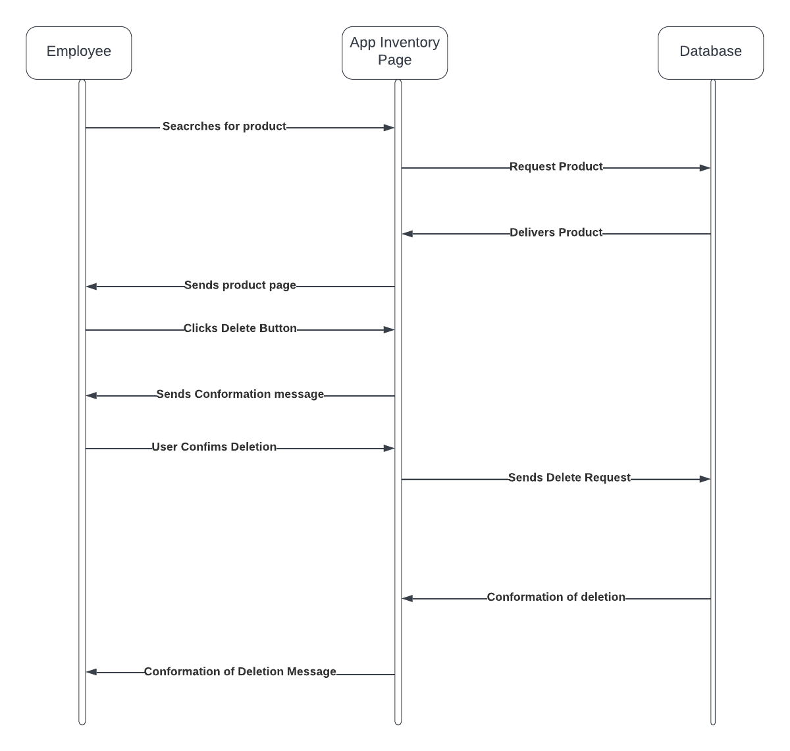

## 4 User Interface Design

UI for login page.
    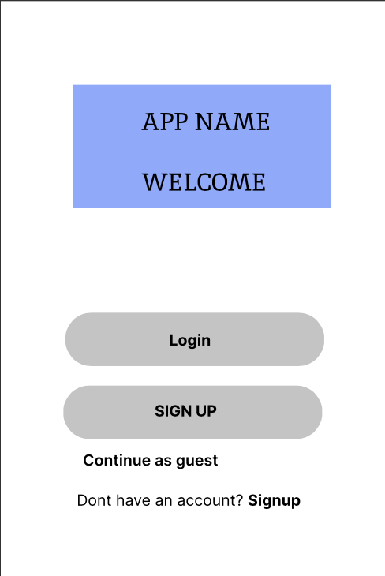

UI for customer product information page.
    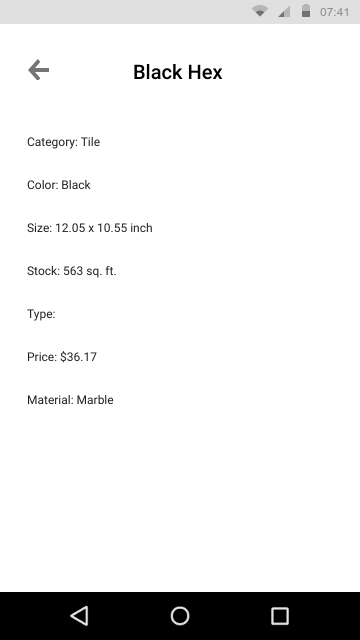

UI for employee product information page.
    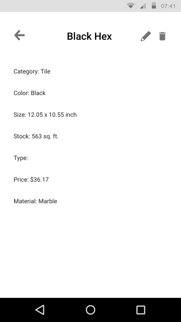

UI for search.
    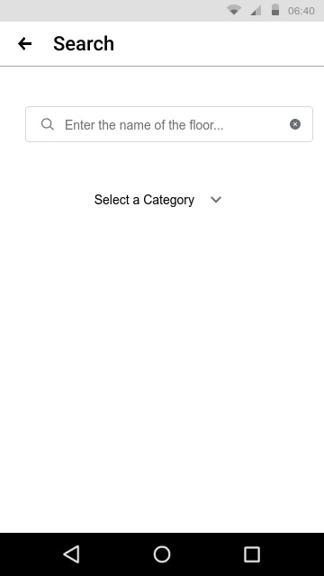

UI for browse by customer.
    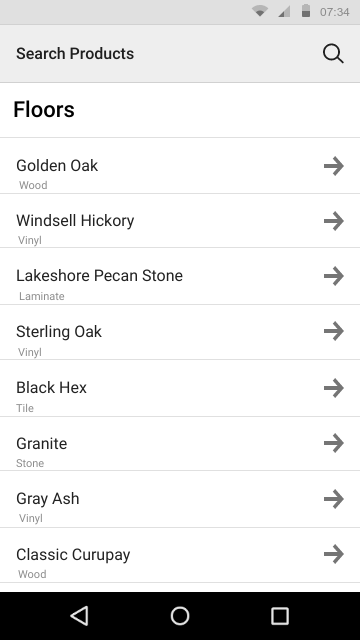

UI for browse by employee.
    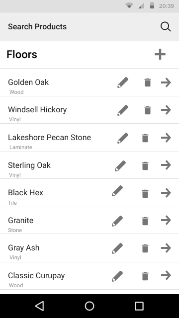

UI for the customer signup page.
    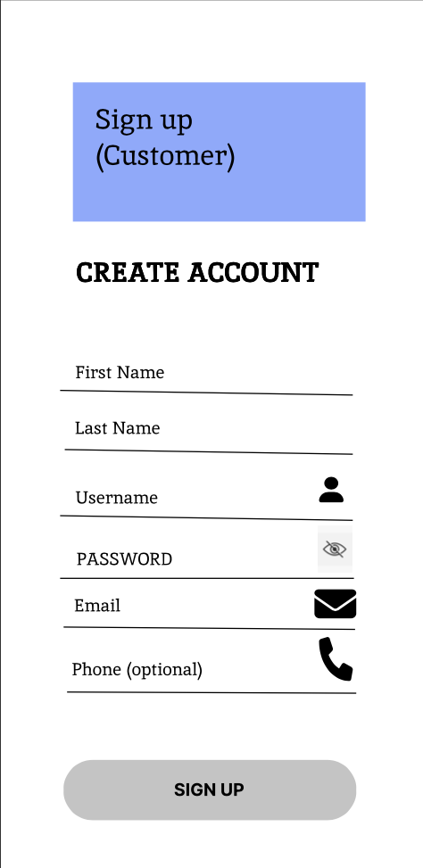

UI for employee login page
    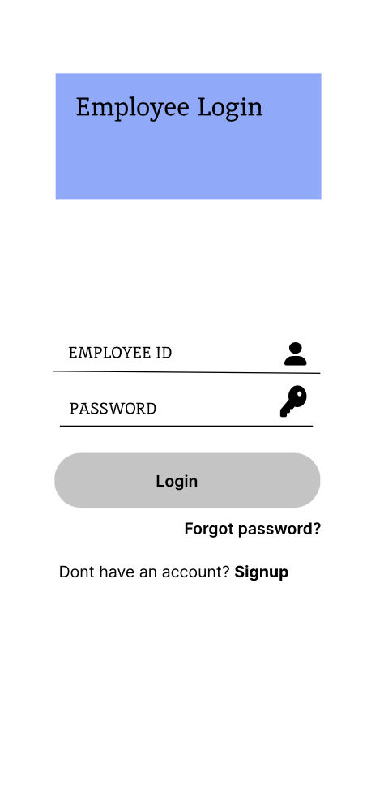

UI for employee signup page.
    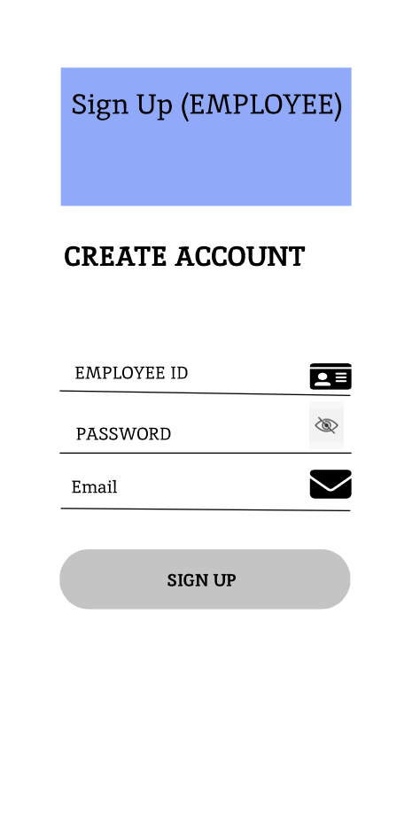

UI for forgot password page.
    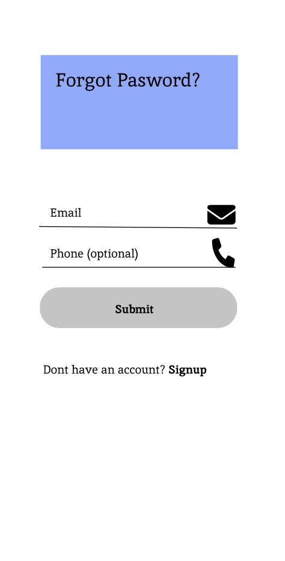
