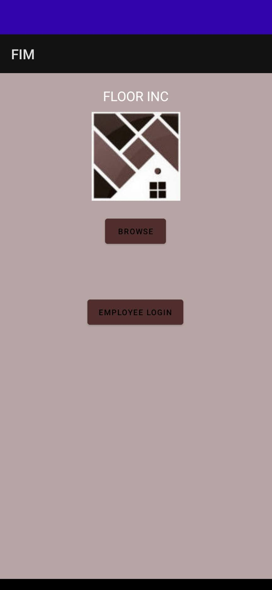
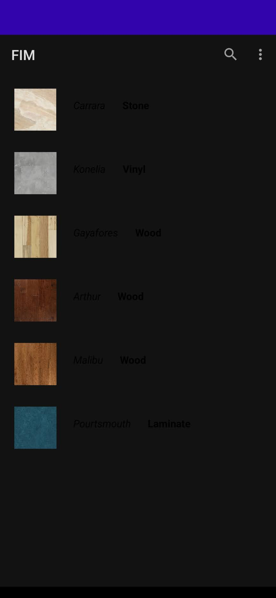
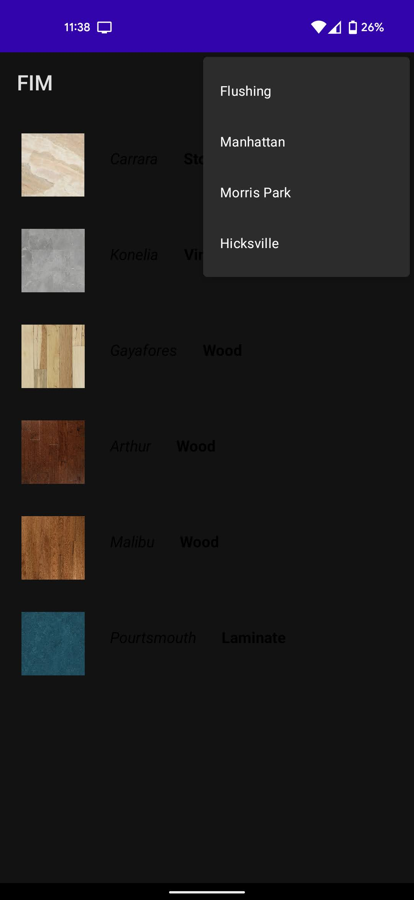
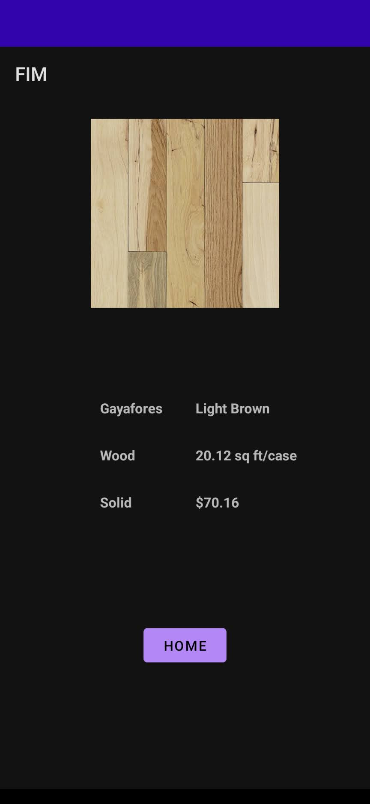
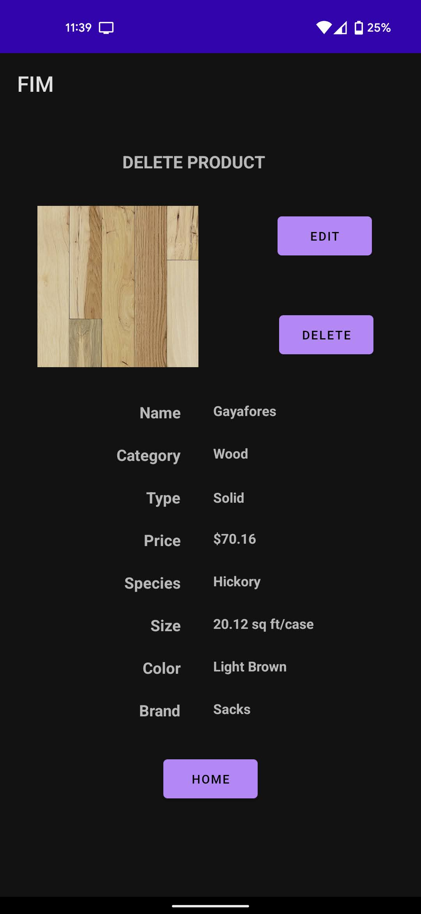
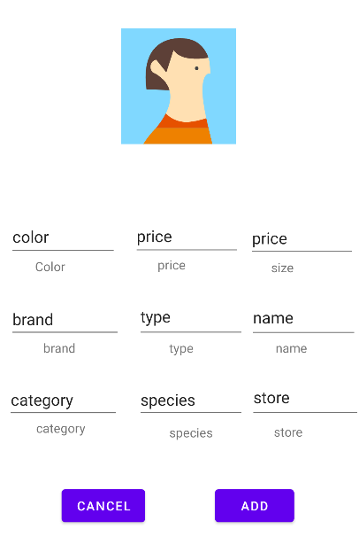
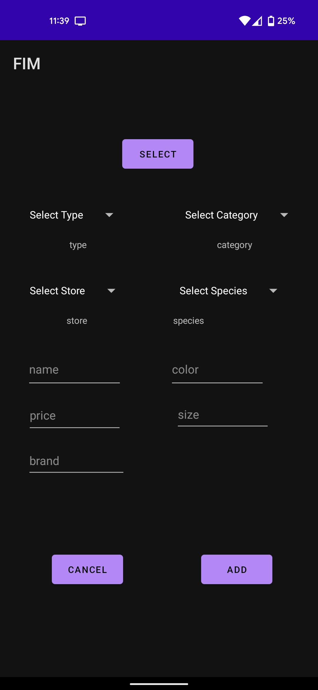
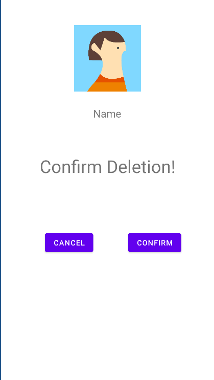

# User Manual
**Author**: Chewantha Jayasundera

The Floor Inc app is designed to allow customers to browse the iventories of multiple stores and to allow employees to modify the inventories of the stores they work in.

### Login

When the app opens, a user has two buttons to select from.
-  If they're an employee they can choose log in with their credentials. In which case they are directed to a login page:

- If they're a normal customer they can browse and they will be directed to the home page. Which lists all of the available products. By default it lists the products in the Flushing Store:

### Store Select as Customer

A customer can get the products that are available in different stores by selecting clicking the icon on the upper right of the screen and selecting a store.

### View Products as Customer

A customer can click on a product image to get more information on it.

Clicking on an image brings up a page with more detailed information of the product. Clicking on the home button takes them back to the home page.

If a user an employee this is the homepage that they are greeted with. It has additional functionality compared to a customer's.

### Store Select as Employee

A employee can get the products that are available in different stores by selecting clicking the icon on the upper right of the screen. Clicking on the home button takes the customer back to the home page.

### Add Products

An employee user can choose to add items by clicking on the add button. A message will pop up informing the user a product was added.

This button redirects to the following page. The employee has to enter all the relevant information and they would be allowed to add a product. They can cancel by clicking the cancel button in which case they will be sent to the employee home page.

### View Products as Employee
If an employee requires more information about a product they can click on the image.

From this page if an employee wants to modify or delete a product they can click on the respective buttons to do so.

### Modify Product

Clicking on the modify button opens this page, here the employee can enter the information they wish to change. They can then confirm the change by clicking the confirm button. The cancel button sends the employee back to the homepage. After clicking confirm the user will be given a confirmation message.

### Delete Product

Clicking on the delete button opens this page. All the employee does here is confirm they want to delete the product. Clicking the button does confirms the deletion and a message will pop up.

